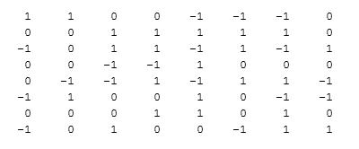

# Позиционирование

Программное обеспечение написано языке сценариев Matlab для обработки изображений и выполнения расчетов. Весь процесс эксперимента схематично показан на блок-схеме.


​											 				**Этапы эксперимента**

## Подготовка изображения

Фрагмент изображения бумаги с напечатанным шаблоном показан на рисунке.


​						**Фрагмент изображения, показывающий массив точек 6×6**


Количество точек, содержащихся в массиве, является минимальным для достаточного количества информации, чтобы идентифицировать позицию при декодировании. Но типичное изображение, полученное камерой, может иметь гораздо больше точек, как показано на рисунке ниже. Черные кривые - объекты, которые необходимо оцифровать. Можно видеть, что шаг сетки точечного рисунка немного меньше ширины надписи.


​							        **Типичное изображение, полученное камерой**


## Обработка

После того, как изображение получено, следующим шагом является его предобработка для последующего декодирования. Данный процесс состоит из преобразования в полутоновое, потом в черно-белое с использованием порогового значения и удаления шума. Эти четыре процесса показаны на рисунке ниже.


​																		**Шаги предобработки**

## Декодирование

После удаления шумов, изображение готово к декодированию. Во-первых, каждая белая область, обозначающая точку, идентифицируется с использованием сценариев Matlab [27,28]. Затем области заменяются собственными центрами (центроидами). Координаты этих центроидов получены в пикселях. Используя эти координаты, получаем новое изображение, где "капли" заменены на центроиды, как показано ниже на рисунке (а).


 																**(a)**                             **(b)**

 **Пример изображения с однопиксельными точками (a) и оно же после FFT (b)**


Рисунок (б) представляет собой двоичное изображение полученное с помощью FFT по изображению из рисунка (а). Это небольшая сетка, которая состоит из девяти точек в середине. Относительное положение девяти точек говорит нам, нужна ли коррекция поворота для исходного изображения [29]. Этот шаг необходим для снижения вероятности возникновения ошибок при декодировании. Если исходное изображение наклонено, 9-точечная сетка будет выглядеть как параллелограмм, а не прямоугольник. Угол для необходимой коррекции равен углу наклона параллелограмма.

Затем центроиды на изображении разделяется на столбцы и строки. Если на изображении M × N точек, то координаты центров записываются в две матрицы M × N, в одну x-координат, а в другую y-координаты.

Из относительных положений внутри одного столбца (строки) все точки можно разделить на 3 вида: левый (L), средний (M) и правый (R), в зависимости от того, в каком направлении смещена точка. Их именно три, так как позиции вверх/вниз (влево/вправо) неразличимы относительно оси X (оси Y).

Если количество точек относительно велико, есть большая вероятность, что все три вида точек можно найти в одном столбце. Но если количество точек относительно мало (6-10 точек на столбец), есть большая вероятность, что в столбце (строке) можно найти только два вида точек (L и M или M и R). Иногда возникает экстремальная ситуация, когда в одном столбце (строке) находится только один вид точек. К счастью, эти три ситуации можно легко идентифицировать, сравнив ширину каждого столбца (строки) с максимальной шириной.

Нужно найти среднюю ширину столбца (строки). Этой информации достаточно для того, чтобы классифицировать столбцы (строки) по содержащимся в них типах точек. Для этого нужно сравнить ширину каждого столбца (строки) со средним значением. Если ширина меньше 1/3 средней ширины, то столбец содержит точки только одного вида (класс С), если от 1/3 до 2/3 - два (класс B), иначе - все три вида (класс A).

В случае столбца (строки) класса А классифицировать точки внутри него достаточно просто. Для этого необходимо раздить ширину столбца на три равных интервала. Те, что попали в первый интервал - левые (L), по середине - средние (M), остальные - правые (R).

Все сложнее, когда дело доходит до последних двух видов столбцов. Решение состоит в том, чтобы принять во внимание другие координаты, основываясь на свойстве, связанном с положением точек на виртуальных линиях. Известно, что существует всего четыре направления, в которых точки могут быть смещены: два по x и два по y. Смещение по одной из осей мы будем называть индикатором. Их зависимость друг от друга отображена в таблице ниже:

**Сравнение между направлением смещение и индикаторами смещения**

| Offset  direction | Indicator in x | Indicator in y |
| :---------------: | :------------: | :------------: |
|       Left        |     -1 (L)     |     0 (M)      |
|       Right       |     1 (R)      |     0 (M)      |
|        Up         |     0 (M)      |     1 (R)      |
|       Down        |     0 (M)      |     -1 (L)     |

Как видно из таблицы, один и только один из двух индикаторов всегда должен быть равен 0. Это свойство полезно, поскольку, если мы не можем определить направление смещения точки в одном измерении, мы можем искать в другом измерении.

Как только направление смещения каждой точки определено, важно убедиться, что оно правильное. Так как качество печати или изображения может быть низким и изображение может быть искажено. Точки, полученные с помощью описанных выше процедур, могут не располагаться точно там, где они должны быть.

После раздела исправления ошибок мы можем декодировать точечный шаблон в последовательности битов, как по направлению x, так и по направлению y. Затем, используя их и следуя указаниям из главы с описанием принципов работы данного шаблона, возможно определить координаты столбцов и строк. Пример данного процесса приведен ниже. Предварительно обработанное двоичное изображение показано на рисунке ниже.


​								 **Подготовленное для декодирования изображение**


Первое, что нужно сделать, это проверить угол наклона изображения. Если все в порядке, то виртуальные растровые линии должны быть параллельны координатной оси. Это то, что нужно. В противном случае мы вычислить искажения и исправить их. Для этого можно использовать преобразование Фурье.

Прежде чем использовать его, устанавливается пороговое значение для фильтрации ненужной информации. Этот процесс необходимо выполнить вручную, чтобы убедиться, что вся информация, кроме девяти точек в середине изображения, отфильтрована. Эти девять точек образуют небольшой параллелограмм. Угол, образованный сторонами параллелограмма, а также горизонтальным и вертикальным направлениями, указывает, параллельны ли виртуальные растровые линии оси координат.


 		                  	**Использование FFT для выравнивания изображения**


Поскольку 9-точечный параллелограмм состоит из 4 меньших параллелограммов, для простоты можно взглянуть на них. В соответствии с геометрическими соотношениями этих точек расчеты производятся следующим образом:

  1. Найдите центральную точку
     $$
     P_c (257,00, 257,00)
     $$


2. Найдите четыре ближайшие точки к центральной точке во всех квадрантах. Это делается путем поиска точки, которая имеет наименьшее евклидово расстояние до центральной точки во всех четырех квадрантах.
   $$
   P_1 (257,33 ;\space269,33)
   $$

   $$
   P_2 (244,67 ;\space 257,33)
   $$

   $$
   P_3 (256,67 ;\space 244,67)
   $$

   $$
   P_4 (269,33 ;\space 256,67)
   $$


3. Определите углы наклона прямых линий, образованных этими точками и центральной. Результат показан в таблице

|       | *P*1*P*c | *P*2*P*c | *P*3*P*c | *P*4*P*c |
| ----- | -------- | -------- | -------- | -------- |
| Slope | 0.9996   | 0.0270   | 0.9996   | 0.0270   |
| Angle | 88.45º   | 1.55º    | 88.45º   | 1.55º    |


Проанализировав полученную информацию, можно понять, что точечный рисунок наклонен на 1,55 градуса. Скорректированное изображение показано на рисунке ниже.


​                                                            **Повернутое изображение**


Затем нужно вычислить координаты центроидов каждой точки.


**Координаты центроидов в направлении x (a) и направлении y (b)**

(a) the x coordinates


 (b) the y coordinates


Используем первый столбец в качестве примера. Минимальное значение координаты х в первом столбце составляет 19,5740, а максимальное - 33,0250. Таким образом,
$$
∆_1 = 33.0250-19.5740 = 13.4510.
$$
Повторим данные вычисления для каждого столбца. Результаты приведены в таблице ниже:


 **Разница между минимумом и максимумом для каждого столбца**

|   Column   |   ∆1    | ∆2      | ∆3      | ∆4      | ∆5     | ∆6      | ∆7     | ∆8      |
| :--------: | :-----: | ------- | ------- | ------- | ------ | ------- | ------ | ------- |
| Difference | 13.4510 | 13.3054 | 13.2591 | 11.9402 | 9.6412 | 15.5719 | 7.4694 | 10.2475 |


$$
∆max = 15,5719
$$

$$
2/3 * ∆max = 10,3813
$$

$$
1/3 * ∆max = 5.1906
$$


Столбцы с разницей больше 10,3813 (класс A):  1, 2, 3, 4 и 6.

Столбцы с разницей между 5.1906 и 10.3813 (класс B): 5, 7 и 8.

Что касается столбцов в классе A, существует три вида точек (учитывая только в направлении х, поэтому точки, которые смещаются вверх и вниз, считаются одним «средним»). Опять же, возьмем первый столбец в качестве примера, разделим расстояние между точкой с минимальной координатой x и точкой с максимальной координатой x на три интервала одинаковой длины в направлении x: [19.5740, 24.0577), [24.0577, 28.5414) и [28.5414, 33.0250]. Присвойте индикатор смещения «-1» точкам, координата x которых попадает в первый интервал (левые), «0» точкам, координата x которых попадает во второй интервал (средние), и «1» точкам, чья Координата х попадает в последний интервал.

Что касается столбцов в классе B, есть только две возможные комбинации направлений смещения для точек - левые и средние или средние и правые. В этой ситуации мы можем сначала разделить расстояние между точкой с минимальной координатой x и точкой с максимальной координатой x на два интервала одинаковой длины. Возьмем, к примеру, пятый столбец массива, интервалы которого равны [191.2804, 196.1010) и [196.1010, 200.9216]. Присвойте индикатор смещения «-2» точкам, координата x которых находится в первом интервале, а индикатор смещения «2» точкам, координата x которых находится во втором интервале. Затем получаются указатели направления смещения, которые показаны в таблице ниже.


**Индикаторы смещения в направлениях x, y (a) в направлении x и (b) в направлении y до коррекции ошибок**

(a) в направлении X


(b) в направлении Y


Индикаторы смещения «-2» и «2» являются только временными. Они не указывают фактическое направление смещения точек, а просто указывают отношение положения внутри столбца. Чтобы узнать фактическое направление смещения, нам нужно учесть индикатор смещения в направлении y, как показано в таблице 5-5 (b). Легко обнаружить, что общая черта столбцов с «2» и «-2» заключается в том, что в этом столбце нет «0».

Теперь сфокусируйтесь на индикаторе смещения столбца 2 в направлении y. Это -1, 2, -1, 1, -1, 1, 2, 0. Вместе с теми в направлении х, они делятся на пары как (-2, -1), (-2,2), ( -2, -1), (-2,1), (-2, -1), (-2,1), (-2,2), (2,0). Мы знаем, что индикаторы смещения в направлении x и y не должны быть одновременно 0, но хотя бы один из них должен быть 0. Таким образом, пары факторов улучшены до (0, -1), (-2, 2), ( 0, -1), (0,1), (0, -1), (0,1), (-2, 2), (2, 0). Затем мы получаем вывод, что во втором столбце индикатор смещения «-2» фактически равен «0», и поэтому индикатор смещения «2» должен быть «1».

Кроме того, обратите внимание, что последняя пара равна (2,0), поскольку «2» указывает, что точка находится в относительно правой половине распределения точек, а ее аналог в направлении y уже равен «0», поэтому она должна быть «1». , Это согласуется с приведенным выше выводом. Наконец, индикатор смещения для пятого столбца в направлении x должен быть: 0, 0, 0, 0, 0, 0, 0, 1. Аналогичный процесс выполняется для двух других столбцов. Обновленные результаты всех столбцов показаны в таблицах ниже.


**Индикаторы смещения в направлениях x, y (a) в направлении x и (b) в направлении y после коррекции ошибок по координатам**

 (a) in the x direction


 (b) in y direction




Однако индикаторы смещения окончательно не проверены. Как видно из двух прошлых таблиц, пары индикаторов в {1,1}, {3,3} и {1,8} равны (-1,1), (-1, 1) и (0, 0) соответственно. Эти пары индикаторов нарушают правила кодирования. Решением этого является реконструкция виртуальных растровых линий [23].

Как только индикаторы смещения получены для обоих направлений x и y, становится легко установить виртуальные растровые линии. Точечный рисунок с растровыми линиями показан на рисунке.


​                               **Реконструированные виртуальные растровые линии**


Поскольку растровые линии получаются через положения точек, которые, возможно, были искажены во время обработки, идеальной сетки не получится и между линиями может быть разный шаг. Однако, это не помещает нам определить направления смещения. Это дополнительный способ убедиться, что индикатор смещения получен правильно. Возьмем пару индикаторов, например, {1,1}.

Расстояние между точкой и растровой линией в направлении х:

$$
Dx = 23,8882 - 25,7418 = -1,8536
$$
Расстояние между точкой и растровой линией в направлении y:

$$
Dy = 321,3851 - 315,8861 = 5,4990
$$
Так как
$$
abs (Dy)> abs (Dx),
$$
направление смещения определяется как направление y. Индикатору присваивается «1» со знаком, определяемым знаком Dy. Поэтому пары индикаторов на {1,1} были скорректированы с (-1,1) до (0,1).


**Окончательные индикаторы смещения**

**(a)  в направлении X**


 **(b) в направлении Y**


Теперь необходимо преобразовать данные последовательности индикаторов в последовательности битов, используя соответствующие таблицы.


​							                      	**Искомые последовательности**


Для направления X из таблицы восемь вертикальных частичных последовательностей получаются следующим образом:
$$
00110101, 01001000, 10011010, 10010000
$$

$$
10101000, 10000111, 10100100, 10001110
$$

Соответствующие места этих частичных последовательностей в основном номере последовательности
$$
47,\space 14,\space 46,\space 15
$$

$$
32,\space 18,\space 13,\space 57
$$

Первичная разностная последовательность дополнительно получается как

$$
30,\space 32,\space 32,\space 17
$$

$$
49,\space 58,\space 44
$$

Вторичные разностные последовательности получены с использованием таблице, приведенной ниже.


**Пример преобразования последовательности PDS во последовательность SDS**

| d    | 30   | 32   | 32   | 17   | 49   | 58   | 44   |
| ---- | ---- | ---- | ---- | ---- | ---- | ---- | ---- |
| a1   | 1    | 0    | 0    | 0    | 2    | 2    | 0    |
| a2   | 2    | 0    | 0    | 1    | 2    | 2    | 1    |
| a3   | 0    | 1    | 1    | 1    | 0    | 1    | 0    |
| a4   | 1    | 1    | 1    | 0    | 2    | 2    | 2    |


Четырьмя частичными последовательностями длиной 5 являются «10002» для A1, «20012» для A2, «01110» для A3, «11102» для A4. Соответствующие номера мест указаны ниже:
$$
p_1 = 119
$$

$$
р_2 = 147
$$

$$
р_3 = 25
$$

$$
р_4 = 178
$$

Если известен номер секции в направлении X, либо получены четыре таких числа для первого блока 8×8 из шаблона, мы можем назначить координату столбца.

  Для первого массива 8 × 8 p1-p4 получаются как
$$
p_1 = 32
$$

$$
р_2 = 57
$$

$$
р_3 = 12
$$

$$
р_4 = 96
$$

Поскольку значения p1-p4 увеличиваются на единицу подряд, когда область интереса перемещается на один столбец вправо, можно создать бесконечную таблицу, представленную ниже:


 **Зависимость между номером столбца и SDS**

|      | Column 1 | Column 2 | Column 3 | …    | Column  x | …    |
| ---- | -------- | -------- | -------- | ---- | --------- | ---- |
| p1   | 32       | 33       | 34       | …    | 119       | …    |
| p2   | 57       | 58       | 59       | …    | 147       | …    |
| p3   | 12       | 13       | 14       | …    | 25        | …    |
| p4   | 96       | 97       | 98       | …    | 178       | …    |


Диапазоны p1, p2, p3 и p4 составляют от 0 до 235, от 0 до 232, от 0 до 30 и от 0 до 240 соответственно. Одинаковые комбинации p1, p2, p3 и p4 встречаются каждые
$$
l1 × l2 × l3 × l4 = 236 × 233 × 31 × 241 = 410815348
$$
столбцов. Что в пересчете в длину составляет
$$
410815348 × 0,3 \space мм = 123244604,4 \space мм = 123,2 \space км.
$$
При просмотре передыдущей таблицы столбец, соответствующий (119, 147, 25, 178), оказывается столбцом 324, что означает, что первый столбец массива 8 × 8 является столбцом 324 всей поверхности. Таким образом, последний столбец массива 8 × 8 - это столбец 331.

Аналогичный процесс сделан для направления y. Вместо использования вертикальных частичных последовательностей в таблице 5-5 используются горизонтальные частичные последовательности. Это 00001110, 1000001, 11001010, 01110111, 11101001, 10110011, 11000000 и 11011100. Номера мест во вторичных разностных последовательностях равны (50, 87, 11, 207). И номера мест для первой строки точечного рисунка равны (224, 19, 4, 155), затем получается таблица для направления у аналогичная таблице для направления X.


**Зависимость между номером строки и SDS**

|       | p1   | p2   | p3   | p4   |
| ----- | ---- | ---- | ---- | ---- |
| Row 1 | 224  | 19   | 4    | 155  |
| Row 2 | 225  | 20   | 5    | 156  |
| Row 3 | 226  | 21   | 6    | 157  |
| …     | …    | …    | …    | …    |
| Row y | 50   | 87   | 11   | 207  |
| …     | …    | …    | …    | …    |


Посмотрев таблицу, координата строки, соответствующая (50, 87, 11, 207), равна строке 535. Таким образом, строки, включенные в представляющий интерес массив 8 × 8, представляют собой строки 535 - строки 542. Декодирование успешно завершено.


## Позиционирование объекта

С помощью любого массива 6 × 6 или 8 × 8 массива точек, который успешно декодируется, мы можем быстро получить точную информацию о положении интересующего нас объекта на оцифрованной поверхности, просто фотографируя интересующую область [ 30,31]. Если мы записываем информацию о положении объекта в первой позиции и информацию об объекте во второй позиции, то расстояние, на которое объект переместился из первой позиции во вторую.

В качестве примера мы можем рассмотреть случай, когда информация о положении массива фоновых точек известна. Это показано на рисунке 5-11. Это может быть немного непрактично, поскольку предполагает, что изображение берется до и после объекта на странице, но в принципе показывает, как метод может быть использован. Однако в случае ручки, в которой точки являются отражающими в инфракрасном диапазоне, а чернила из ручки прозрачны для инфракрасного, этот метод должен работать. В обоих случаях - как продолжение этого - если поле зрения достаточно широкое и до тех пор, пока один 8 × 8 может использоваться для получения абсолютной координаты, эта информация может использоваться для экстраполяции информации о скрытых точках. Эта информация может быть использована для вычитания точек из изображения.


​																	(a)                    (b)                     (c)

**Figure 5-11 (a) the preprocessed image of the region of interest, with the object (the circle) at its starting position (b) the known dot pattern of the background, which will provide the position of the region (c) extracted from (a), which is a binary image of the object with the position relation unchanged from (a). 60****×** **magnification.**


Поскольку мы уже знаем положение массива 8 × 8 во всем точечном паттерне, нам нужно найти объект в этом массиве. Эта задача сводится к нахождению центроида данного обхекта.

1. Получить координаты в пикселях центроида объекта на изображении.

$$
Pobject (238,7545 ;\space 224,2730)
$$

2. Сравните координату точки P_object с растровыми линиями. Можно обнаружить, что точка расположена между 6-м столбцом и 7-м столбцом, 3-й строкой и 4-й строкой.

3. Добавьте десятичную часть к местоположению точки, чтобы указать ее точную координату в столбцах и строках.

   ```python
   x_colums_6th = 234,1396;
   x_colums_7th = 279,4906;
   y_colums_3th = 230.8409.
   y_colums_4th = 192.1063.

   Object_Column = (238,7545 - 234,1396) / (279,4906-238,7545) + 6 = 6,1018;
   Object_Row = (224.2730-230.8469) / (192.1063-230.8469) + 3 = 3,1696.
   ```

4. Координаты столбца и строки центроида в точечном растре получают как:
   $$
   C = 6.1018 + 324 -1 = 329.1018
   $$

   $$
   R = 3,1696 +535 -1 = 537,1696
   $$


Тот же процесс можно выполнить, когда объект переместился в свою конечную позицию. И тогда мы можем получить другую координату его центроида, координату в конечной позиции. Если это значение (923.2411, 345.5511), то, используя базовые знания векторной и евклидовой геометрии, мы можем рассчитать расстояние, на которое перемещается объект, следующим образом:
$$
Distance = sqrt((923.2411 - 329.1018)^2 + (345.5511 - 537.1696)^2) = 624.27
$$
Это основано на расстоянии сетки в направлении х и в направлении у, которые равны, что, конечно, не является действительно необходимым. Тогда, как мы знаем заранее, расстояние сетки в обоих направлениях составляет 0,3 мм, таким образом, расстояние 624,27 × 0,3 мм = 187,3 мм.
